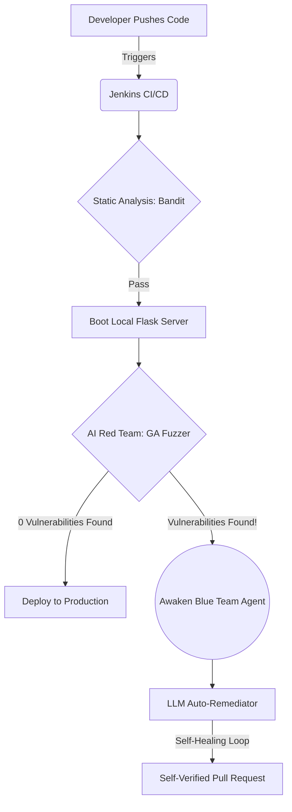
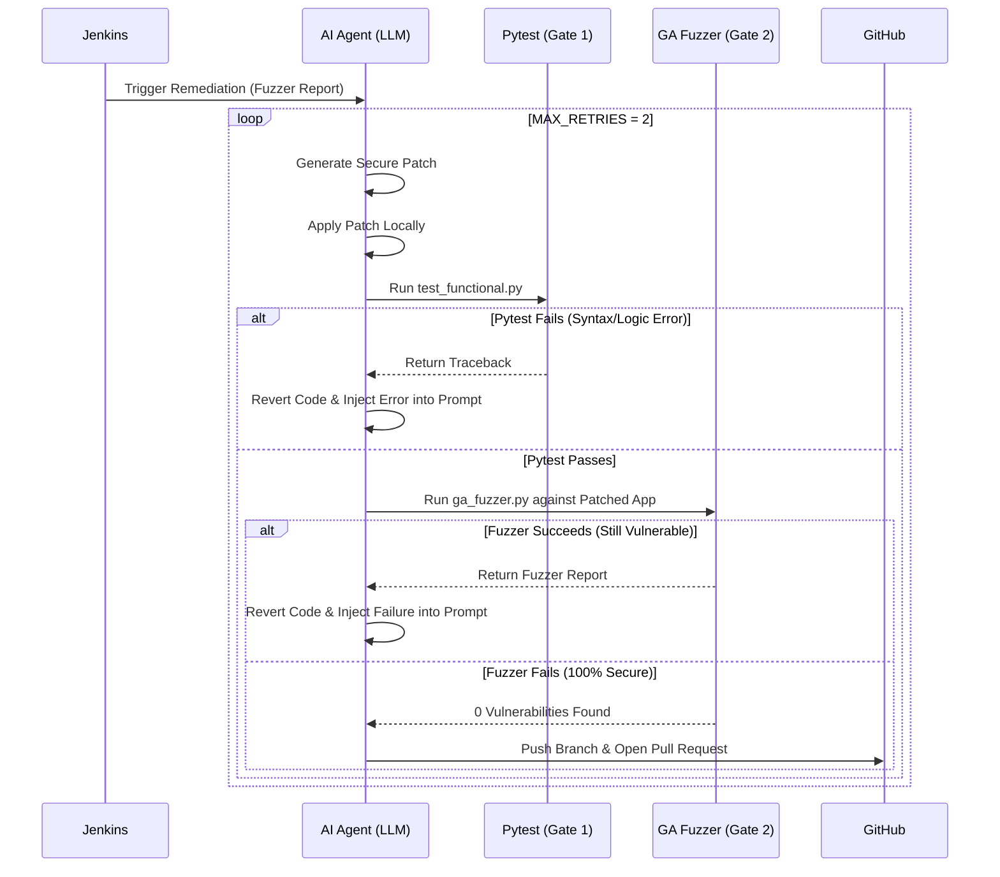

# GenePatch: Autonomous AI DevSecOps Pipeline


GenePatch is an experimental, fully autonomous DevSecOps pipeline that simulates an endless game of cat-and-mouse between an **AI Red Team** and an **AI Blue Team**. 

Instead of relying on human engineers to patch vulnerabilities found during CI/CD, GenePatch utilizes a **Genetic Algorithm Fuzzer** to actively mutate payloads and breach the application. When a breach occurs, an **Autonomous AI Agent (LLM)** wakes up, mathematically analyzes the exploit, writes a secure code patch, runs tests on its own code, and opens a self-verified Pull Request.

---

## 🏗️ High-Level Architecture

The pipeline runs automatically via Jenkins every time code is pushed to the `main` branch. 



---

## 🧠 The Self-Healing Agent Loop

The core innovation of GenePatch is the `ai_auto_remediator.py` script. It does not blindly open Pull Requests. Instead, it acts as an autonomous agent that enforces strict security and functional gates on its own generated code.

If the AI writes a patch that breaks the application or fails to stop the fuzzer, it captures the error log, feeds it back into its own prompt, and tries again.



---

## 🧩 Core Components

### 1. The Target: Vulnerable Flask App
A purposely vulnerable web application (`app.py`, `database.py`) containing classic OWASP Top 10 vulnerabilities, including:
- SQL Injection (Authentication Bypass)
- Cross-Site Scripting (Reflected & Stored)
- Path Traversal

### 2. The Red Team: Genetic Algorithm Fuzzer
A custom security fuzzer (`ga_fuzzer.py`) that uses evolutionary algorithms to dynamically mutate payloads. Instead of relying on static wordlists, it "breeds" payloads, keeping the mutations that trigger HTTP 500 errors or bypass login pages, until it successfully breaches the endpoint.

### 3. The Blue Team: Autonomous Agent
The LLM Remediator (`ai_auto_remediator.py`) utilizes the Google Gemini API. It receives the exact payload that breached the system alongside the raw source code. It then rewrites the underlying architecture using secure coding standards (e.g., Parameterized Queries) rather than just creating regex filters.

---

## 📸 Demonstration & Screenshots

*(Insert screenshots of the pipeline in action here)*

### 1. Jenkins Pipeline Execution
> **Placeholder:** Screenshot showing the Jenkins stages (Checkout -> Build -> Bandit -> Fuzzer -> Remediation).


### 2. The Genetic Fuzzer Mutating Payloads
> **Placeholder:** Screenshot of the terminal showing `ga_fuzzer.py` evolving generations of SQLi payloads.


### 3. The Self-Healing Loop in Action
> **Placeholder:** Screenshot of the Jenkins console where the AI fails Pytest, realizes its mistake, rewrites the code, and finally passes.


### 4. The Self-Verified Pull Request
> **Placeholder:** Screenshot of the GitHub PR automatically opened by the AI, showing the diff where it replaced raw SQL with parameterized queries.


---

## 🚀 Setup & Installation

### Prerequisites
- Python 3.9+
- Jenkins (configured for local execution)
- Google AI Studio API Key (`GEMINI_API_KEY`)
- GitHub Personal Access Token (`GITHUB_TOKEN`)

### Installation
1. Clone the repository:
   ```bash
   git clone https://github.com/Snehalgupta-07/GenePatch.git
   cd GenePatch
   ```
2. Create a `.env` file in the root directory:
   ```env
   GEMINI_API_KEY=your_gemini_key_here
   GITHUB_TOKEN=your_github_token_here
   ```
3. Set up Jenkins to point to this repository and execute the `Jenkinsfile` as a standard Pipeline.

---

## ⚠️ Disclaimer
**DO NOT RUN THIS IN A PRODUCTION ENVIRONMENT.** This repository contains purposely vulnerable code and automated fuzzing tools designed exclusively for educational and architectural demonstration purposes.
